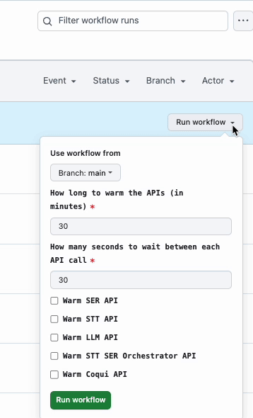

# Keeping Cloud APIs Warm

## Overview
This repo shows a hacky way of handling the cold start issue with Google Cloud services, using a simple GitHub Action automation script. 



### What are cold starts?
The cold start issue in this context means that when a GCP API (like Cloud Run or Google Cloud Functions) have not been invoked for a certain amount of time, their servers will shutdown; therefore, the next time they are invoked, their response times will be slow due to needing to reboot the server and load anything to get the service back to an active state. 

### Are cold starts bad?

Having the server scale to 0 (shutdown) is actually a good thing because it means that when the servers are not being used we are not being charged; however, this is not good if you want your APIs to be responsive. 

The cold start problem is less of an issue for highly active APIs, which is because when the API is consistently serving traffic for an extended period of time, GCP will not shut the APIs server down. 

The cold start issue mainly arises when you have APIs with sparse usage, meaning they are only invoked once in a while. 

### How does this script solve the cold start issue?

If we know beforehand when the APIs will be in use, and therefore need to be warmed up, we can utilize an automated script to send API requests to warm up the servers when they need to be. 

My solution was to make a script which pings the servers for a specified period of time, at a specified interval. 

An example if when this would happen is if you need to demo an app, which you may only use once every few weeks; however, you do not want your responses to be slow for the demo. However, when there is no demo occurring, you do not your APIs to be live, and racking up cloud costs. 


### How it works
```
- Generate a token for every API
- Iterate using a while loop for the specified time period 
    - Ping each API using the generated token and a curl command
- Exit when time period is complete. 
```

### Notes
This probably is not the most elegant or optimal solution for handling cold starts; however, it works for the specific use case of APIs with sparse usage. I am sure there may be issues that I have not seen yet doing this. 

### TODO
Either add another parameter to set a schedule, or make separate workflow. Right now, the workflow only runs for a specified amount of time, but does not repeat unless manually started.

If we know before hand that we want the APIs to be warm every weekday from noon to 6pm PST for example, this should be possible using this script, by adding a cron parameter. 


